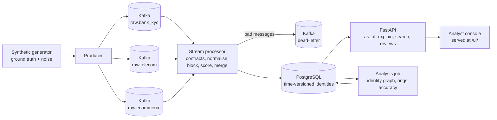

# Pehchaan: Real-Time Identity Resolution for Indian Data

*Pehchaan (पहचान) means "identity".*

Fraud detection is only as good as the identity data underneath it. Before you can ask
"is this person risky?", you must answer a harder question: **which of these messy records,
from different companies, describe the same real person?**

```
Bank KYC     R. Karthik         DOB 12/04/1999   #14, Gandhi Ngr Rd
Telecom      KARTHICK RAMESH    +91 98450 12345
E-commerce   karthik.r          098450-12345     14 Gandhi Nagar Road - 600020
```

Pehchaan ingests records like these from three sources in real time, resolves them into
identities, keeps a full history of every decision, explains each link in plain language,
and analyses the identity graph to tell **families** (legitimate sharing) apart from
**fraud rings** (synthetic identities sharing phones and devices).

## Results (seed 42: 3,094 people, 7,512 records, 15 planted fraud rings)

| Metric | Value |
|---|---|
| Matching precision (pairwise) | **98.8%** |
| Matching recall (pairwise) | **92.6%** |
| F1 | **95.6%** |
| Fraud rings flagged | **12 / 15** (80%) |
| Families falsely flagged as fraud | **0 / 222** |
| Throughput (single Python process) | ~1,600 records/sec |

Because the data is synthetic, every number is measured against known ground truth.
Remaining errors are analysed in [docs/DECISIONS.md](docs/DECISIONS.md).

## What makes it different

1. **Built for Indian names.** A custom phonetic key handles transliteration
   (Lakshmi/Laxmi, Dhivya/Divya, Mohd/Muhammad, Shriram/Sriram), initials
   ("R. Karthik"), and name-order variation.
2. **Families are not fraud.** A shared phone is not proof of anything. Graph
   components are scored on behaviour: creation bursts, KYC coverage, device sharing,
   shared home address.
3. **Time travel.** Assignments are versioned (SCD Type 2), so the API answers
   *"what did we believe about this person on 1 March?"*, essential for audits.
4. **Explainable.** Every link stores its evidence: `names agree strongly (0.99) (+3.0)`,
   `shared phone (+2.5)`, `different dates of birth (-4.0)`.
5. **Production habits.** Schema contracts with drift detection, a dead-letter queue,
   idempotent processing, PII hashing and masking, consumer-lag metrics, crash-safe restarts.
6. **An analyst console.** A review queue for flagged groups with a graph view, decisions
   saved to the database (future training labels), phonetic name search, and time travel
   on every identity. It uses only the public API, so it doubles as proof the API is complete.

## Architecture



Per record: **contract check → normalise → blocking lookup → pair scoring → new / join / merge → store with history**.

## Quick start A: no Docker (any OS, 2 minutes)

The core engine uses only the Python standard library.

```bash
python -m pehchaan.generator          # creates data/records.jsonl + data/ground_truth.csv
python -m pehchaan.offline --fresh    # resolves everything into SQLite, prints the report
```

Then the API and the console (on SQLite):

```bash
pip install fastapi uvicorn
uvicorn pehchaan.api.main:app --reload
```

- **http://localhost:8000** opens the analyst console
- **http://localhost:8000/docs** opens the interactive API docs

Tests: `pip install -r requirements.txt` then `pytest -q` (32 tests).

## Quick start B: full streaming stack (Docker)

```bash
docker compose up -d --build                                       # Kafka, Postgres, processor, API
docker compose run --rm tools python -m pehchaan.generator          # generate data
docker compose run --rm tools python -m pehchaan.stream.producer --rate 300   # stream it
docker compose logs -f processor                                   # watch: rate, lag, totals
docker compose run --rm tools python -m pehchaan.analyze            # graph analysis + accuracy
```

Open **http://localhost:8000** while the producer runs: the console's overview refreshes every
5 seconds, so you can watch records arrive, identities form and merges happen live. The review
queue fills once the analysis job has run.

The processor logs a metrics line every 10 seconds:

```
metrics rate=298/s lag=12 totals={'new': 1650, 'joined': 1302, 'merged': 9, ...}
```

Try crashing it mid-stream (`docker compose restart processor`). It rebuilds from the
database and resumes from the last committed offset without duplicating anything.

## Analyst console

| Page | What it shows |
|---|---|
| Overview | Live counts, the review queue at a glance, latest records and merges (auto-refresh) |
| Review queue | Groups labelled suspicious ring / needs a look / likely family, with their strongest signal |
| Group | A graph of how identities connect (device, phone, address), the scoring reasons, and a decision box: *Confirm fraud* or *Mark false alarm*, with a note |
| Identity | Every record, a **View as of** date picker, the merge history, and the evidence behind each link |
| Search | One box for name, phone or email. Name search is phonetic: "laxmi iyer" finds "Lakshmi Iyer" |

Plain HTML, CSS and JavaScript, no build step. FastAPI serves it from `pehchaan/api/static/`.
All user-supplied text is escaped before rendering.

## API tour

With seed 42 these exact ids exist.

**Time travel.** Suresh Banerjee's two shopping accounts and his bank KYC were separate
identities until 20 Feb, when a telecom record carrying both his phone and his date of
birth bridged them:

```
GET /identities/PID0000231?as_of=2026-02-19   → 2 records (e-commerce only)
GET /identities/PID0000231                    → 4 records (e-commerce, bank, telecom)
GET /identities/PID0000627?as_of=2026-02-19   → active, 1 record (bank KYC)
GET /identities/PID0000627                    → status "merged", merged_into PID0000231
GET /identities/PID0000231/history            → when each record joined, and why
```

**Explanations:**

```
GET /identities/PID0000231/explain
→ EC-0001486 ~ EC-0001487  score 8.0
    names agree strongly (0.99) (+3.0), shared phone (+2.5), similar address (1.00) (+1.0),
    same pincode (+0.5), shared device (+1.0)
→ BK-0001234 ~ TC-0001576  score 5.5
    names agree strongly (1.00) (+3.0), same date of birth (+2.5)
```

**Other endpoints:**

```
GET /search?q=laxmi iyer               name, phone or email, detected automatically
GET /search?phone=+91 98450-12345      any phone format works (normalised first)
GET /rings?label=SUSPICIOUS_RING       latest graph analysis, with reasons and review status
GET /rings/{run_id}/{component_id}     one group with graph nodes and edges
POST /rings/{run_id}/{component_id}/review   {"decision": "confirmed_fraud" | "false_alarm", "note": "..."}
GET /overview, GET /activity           counts and the latest records/merges for the console
GET /records/EC-0001487?as_of=2026-02-01
GET /stats
```

Phones and emails are masked in responses (`+91******2345`). Government IDs are stored
only as salted hashes and never returned.

## Project structure

```
pehchaan/
├── generator/          synthetic people, families, fraud rings, messy records
├── contracts.py        per-source schemas, drift detection
├── normalize.py        phones, names, emails, DOBs, addresses, PII hashing
├── phonetic.py         Indian-name phonetic key
├── similarity.py       Jaro-Winkler (from scratch), name & address similarity
├── matching.py         blocking keys + evidence scoring with reasons
├── resolver.py         incremental resolution: new / join / merge
├── store.py            SQLite/PostgreSQL store with SCD-2 history
├── rings.py            union-find graph components, family vs ring scoring
├── evaluate.py         pairwise precision/recall + error breakdown
├── analyze.py          batch job: rings + accuracy report
├── offline.py          whole pipeline in one process (no Kafka)
├── stream/             Kafka producer + stream processor
└── api/                FastAPI routes, testable service layer, static/ console
docs/DECISIONS.md       design decisions, measurements, open issues
tests/                  unit, time-travel, console, HTTP-route and end-to-end accuracy tests
```

## Configuration

All settings are environment variables (see `pehchaan/config.py`): `PEHCHAAN_DB_URL`,
`KAFKA_BOOTSTRAP`, `MATCH_THRESHOLD`, `NAME_MIN_SIMILARITY`, `BLOCK_CAP`, `PII_SALT`.

## Roadmap

- **Phase 5:** raw events to a Parquet data lake on MinIO (S3-compatible); nightly
  Airflow DAG running a PySpark full re-resolution and the graph analysis.
- **Phase 6:** chaos mode (schema drift, consumer lag, duplicates, late data, volume
  spikes), monitoring, and written postmortems.
- Learned weights (logistic regression on the same features) compared against rules.

*All data is synthetic. No real personal information is used.*
